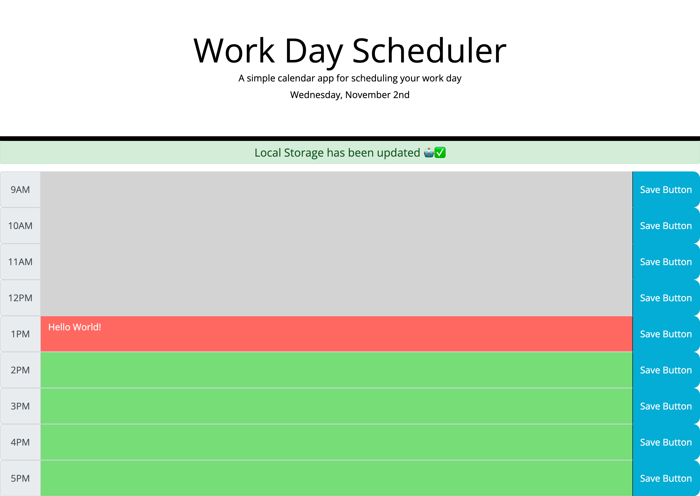

# Work-Day-Scheduler

## Description

Creating the Work Day Schedule was a great way to continue practicing my skills with Bootstrap, jQuery, and Moment.js. Using these third-party APIs allowed me to create an application that felt and looked a lot more user friendly due to the fact that I could use more of my time focusing on the logic aspect of this project.  I was also presented the opportunity to practice the DRY principles where instead of having a local storage function for each textarea, I was able to create one single function with parameters. 

## Deployed Website

The following is are screenshots and the url of the deployed website: 

- https://albertosuarez8.github.io/Work-Day-Scheduler/
